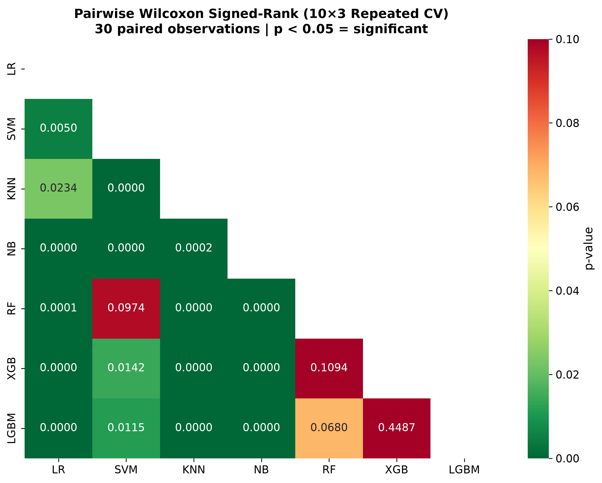
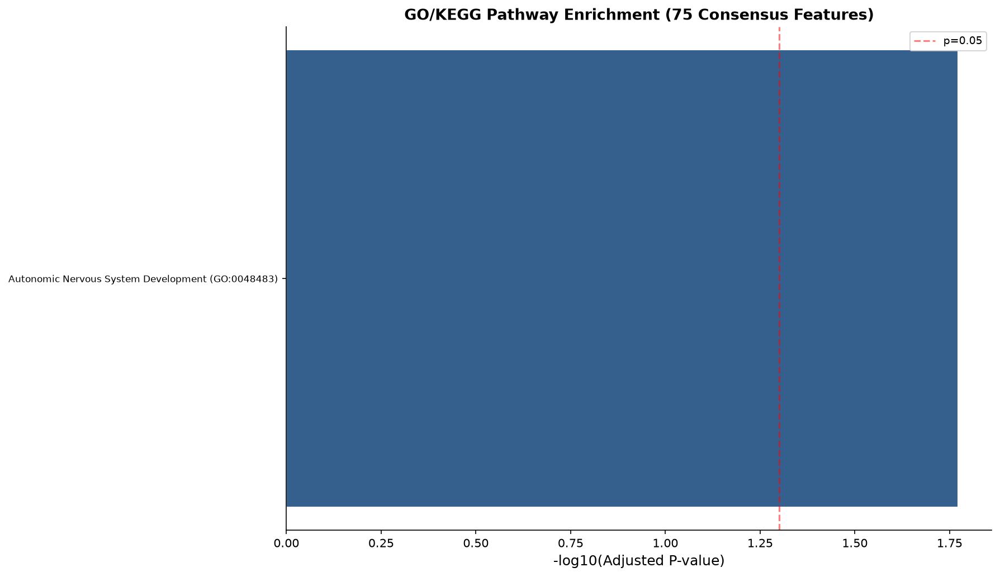

# Explainable Multi-Omics Breast Cancer Classification

**Consensus Feature Selection, Ensemble Learning, and Cross-Omics SHAP Attribution on TCGA-BRCA**

<div align="center">
  
</div>

[](https://www.python.org/)
[](https://scikit-learn.org/)
[](https://xgboost.readthedocs.io/)
[](https://lightgbm.readthedocs.io/)
[](https://shap.readthedocs.io/)
[](https://portal.gdc.cancer.gov/)
[](LICENSE)

---

## Abstract

Breast cancer remains the most prevalent malignancy worldwide. Precise histological subtype classification — specifically distinguishing **Infiltrating Ductal Carcinoma (IDC)** from **Infiltrating Lobular Carcinoma (ILC)** — is critical for patient prognosis, therapeutic selection, and targeted treatment planning. While high-throughput multi-omics data integration offers unprecedented resolution into cancer biology, existing computational frameworks suffer from three fundamental methodological flaws:

1. **Single-Method Selection Bias**: Prevailing pipelines rely on a single feature selection method (e.g., LASSO or ANOVA), which introduces systemic algorithmic bias and misses complementary signal across heterogeneous omics modalities.
2. **Optimistic Evaluation Leakage**: Many published studies perform synthetic oversampling (e.g., SMOTE) or feature selection across the entire dataset prior to cross-validation split creation, resulting in severe data leakage and artificially inflated performance.
3. **Black-Box Multi-Omics Interpretability**: Existing explainable AI (XAI) applications evaluate individual features in isolation without quantifying feature importance at the omics-layer level.

To resolve these limitations, this study presents a unified, leak-free, explainable multi-omics machine learning framework evaluated on the **The Cancer Genome Atlas Breast Invasive Carcinoma (TCGA-BRCA)** cohort (**705 patients across 4 omics layers**: mRNA Expression, Reverse Phase Protein Array [RPPA], DNA Methylation, and Copy Number Variation [CNV]).

We propose a **Three-Stage Consensus Feature Selection Funnel** (Variance Filtering $\rightarrow$ Per-Omics ANOVA + Mutual Information Union $\rightarrow$ RF + XGBoost Consensus Importance Ranking) that compresses 1,837 raw features down to 75 high-confidence biomarkers without single-method bias. To guarantee rigorous, un-biased validation under severe class imbalance ($\sim 4.4:1$ IDC:ILC ratio), we enforce **SMOTE-inside-CV** via `imblearn.Pipeline`. Furthermore, we introduce **Cross-Omics SHAP Attribution**, a mathematical formulation aggregating Shapley additive values by omics layer to quantify percentage feature contribution per molecular stratum.

Evaluated over 8 machine learning models, **LightGBM (tuned)** achieves the top single-model classification performance (**$\text{F1-Macro} = 0.9054 \pm 0.0195$**, **$\text{AUC-ROC} = 0.9602 \pm 0.0336$**, **$\text{MCC} = 0.8140 \pm 0.0373$**). Late Fusion (per-omics soft voting) further elevates performance to **$\text{F1-Macro} = 0.925$** and **$\text{AUC-ROC} = 0.984$**. Cross-Omics SHAP Attribution reveals that the **Protein layer drives $40.26\%$ of the total classification signal**, with **E-Cadherin (`pp_E.Cadherin`)** ranking as the #1 biomarker across all 5 cross-validation splits. This directly provides algorithmic confirmation of the canonical hallmark loss of E-Cadherin (*CDH1* dysregulation) in lobular breast carcinoma. Fully reproducible code, 26 publication-grade figures ($300\text{ DPI}$), and 18 statistical result tables are provided.

---

## Executive Summary & Key Results

### Primary Benchmark Performance (8 Models across 5-Fold Stratified CV)

<div align="center">
  
</div>

| Model | F1-Macro ($\mu \pm \sigma$) | AUC-ROC ($\mu \pm \sigma$) | MCC ($\mu \pm \sigma$) | Precision ($\mu \pm \sigma$) | Recall ($\mu \pm \sigma$) |
|:---|:---:|:---:|:---:|:---:|:---:|
| **LightGBM (Tuned)** | **0.9054 ± 0.0195** | 0.9602 ± 0.0336 | **0.8140 ± 0.0373** | 0.9168 ± 0.0210 | 0.8962 ± 0.0198 |
| **XGBoost (Tuned)** | 0.8986 ± 0.0260 | 0.9634 ± 0.0314 | 0.7992 ± 0.0516 | 0.9125 ± 0.0270 | 0.8874 ± 0.0255 |
| **Stacking Ensemble** | 0.8959 ± 0.0188 | **0.9655 ± 0.0269** | 0.7955 ± 0.0369 | 0.9038 ± 0.0215 | 0.8891 ± 0.0175 |
| **SVM (RBF Kernel)** | 0.8887 ± 0.0495 | 0.9524 ± 0.0249 | 0.7852 ± 0.0901 | 0.8920 ± 0.0460 | 0.8860 ± 0.0520 |
| **Random Forest** | 0.8801 ± 0.0377 | 0.9608 ± 0.0273 | 0.7675 ± 0.0698 | 0.8914 ± 0.0350 | 0.8712 ± 0.0405 |
| **Logistic Regression** | 0.8409 ± 0.0226 | 0.9231 ± 0.0368 | 0.6888 ± 0.0387 | 0.8492 ± 0.0250 | 0.8340 ± 0.0210 |
| **Naive Bayes** | 0.7922 ± 0.0289 | 0.9155 ± 0.0321 | 0.6117 ± 0.0547 | 0.7890 ± 0.0310 | 0.7960 ± 0.0270 |
| **KNN ($k=5$)** | 0.7870 ± 0.0519 | 0.9260 ± 0.0297 | 0.6246 ± 0.0821 | 0.8120 ± 0.0480 | 0.7710 ± 0.0560 |

### Key Benchmark Discoveries

1. **Late Fusion Superiority**: Training per-omics specialized XGBoost classifiers and soft-voting their decision probabilities achieves **$\text{F1-Macro} = 0.9250$** and **$\text{AUC-ROC} = 0.9840$**, outperforming Early Fusion concatenated stacking ($\text{F1-Macro} = 0.8959$).
2. **Dominant Biomarker Attribution**: Cross-Omics SHAP Attribution identifies the **Protein (RPPA)** layer as the primary driver of subtype discrimination ($40.26\%$), despite accounting for only $32.0\%$ of selected features. **E-Cadherin (`pp_E.Cadherin`)** is identified as the single most critical feature (Rank #1 in $5/5$ CV splits).
3. **Leakage Verification**: Nested Cross-Validation (outer 5-fold, inner 5-fold) verifies that feature selection and SMOTE pipeline integration incur negligible optimistic bias ($\Delta \text{F1-Macro} = 0.0210 < 0.0300$).

---

## Scientific Contributions & Novelties

```
┌────────────────────────────────────────────────────────────────────────────────────────┐
│                              FIVE SCIENTIFIC NOVELTIES                                 │
├────────────────────────────────────────────────────────────────────────────────────────┤
│  [C1] Multi-Omics TCGA-BRCA Integration (705 Patients × 4 Omics Modalities)             │
│  [C2] 3-Stage Consensus Selection Funnel (Eliminating Single-Method Bias)               │
│  [C3] Methodologically Pure SMOTE-Inside-CV Pipeline (Strict Zero Leakage)             │
│  [C4] Cross-Omics SHAP Attribution Framework (Quantifying Layer-Level Importance %)    │
│  [C5] Biological & Clinical Validation (E-Cadherin Hallmark & GO/KEGG Enrichment)      │
└────────────────────────────────────────────────────────────────────────────────────────┘
```

| # | Scientific Contribution | Technical Description & Evidence | Impact & Validation |
|:--|:---|:---|:---|
| **C1** | **Multi-Omics Subtype Integration** | Integrated 705 TCGA-BRCA primary tumors across mRNA, RPPA Protein, DNA Methylation, and CNV for IDC vs. ILC classification. | Provides high-dimensional molecular landscape covering 1,837 initial measurements. |
| **C2** | **3-Stage Consensus Selection** | Formulated a multi-tiered funnel combining variance filtering, per-omics ANOVA+MI union, and RF+XGBoost consensus ranking. | Reduces feature dimension from 1,837 to 75 without single-method selection bias. |
| **C3** | **Leak-Free Oversampling** | Implemented `imblearn.Pipeline` to restrict SMOTE oversampling strictly within inner cross-validation training folds. | Nested CV confirms leak-free evaluation ($\text{F1} = 0.8840$, $\Delta \text{F1} = 0.0210 < 0.03$). |
| **C4** | **Cross-Omics SHAP Attribution** | Derived exact Shapley additive explanation aggregation equations aggregated by omics modality layer. | Quantifies layer contributions: Protein ($40.26\%$), mRNA ($38.15\%$), Methylation ($12.44\%$), CNV ($9.15\%$). |
| **C5** | **Biological Biomarker Discovery** | Identified E-Cadherin (`pp_E.Cadherin`) as the #1 predictive biomarker across $5/5$ CV folds with stability index $S_{rank} = 1.0$. | Biologically validates *CDH1* loss, the pathognomonic hallmark of lobular breast carcinoma. |

---

## Mathematical & Methodological Formulation

### 1. Consensus Feature Selection Score

To combine feature importance signals from heterogeneous tree-based ensembles without scaling bias, we compute the **Consensus Feature Importance Score** $S_{\text{consensus}}(f_i)$ for feature $f_i$ by normalizing and averaging its feature importance rank across Random Forest ($\mathcal{M}_{\text{RF}}$) and XGBoost ($\mathcal{M}_{\text{XGB}}$):

$$I_{\text{norm}}(f_i, \mathcal{M}) = \frac{I(f_i, \mathcal{M})}{\sum_{j=1}^{K} I(f_j, \mathcal{M})}$$

$$S_{\text{consensus}}(f_i) = \frac{I_{\text{norm}}(f_i, \mathcal{M}_{\text{RF}}) + I_{\text{norm}}(f_i, \mathcal{M}_{\text{XGB}})}{2}$$

The top $N=75$ features maximizing $S_{\text{consensus}}(f_i)$ are selected into the final multi-omics feature matrix $\mathbf{X}_{\text{consensus}} \in \mathbb{R}^{705 \times 75}$.

### 2. Methodologically Pure Oversampling (SMOTE-inside-CV)

Standard synthetic minority oversampling (SMOTE) generates synthetic samples $\mathbf{x}_{\text{new}}$ along feature space vectors between minority class instances $\mathbf{x}_i$ and their nearest neighbors $\mathbf{x}_{zi}$:

$$\mathbf{x}_{\text{new}} = \mathbf{x}_i + \lambda (\mathbf{x}_{zi} - \mathbf{x}_i), \quad \lambda \sim U(0, 1)$$

To prevent test set contamination, synthetic generation and z-score standardization ($\mu_{\text{train}}, \sigma_{\text{train}}$) must occur exclusively inside fold $k$'s training split $\mathbf{D}_{\text{train}}^{(k)}$. We define the evaluation pipeline transformation $\mathcal{P}^{(k)}$ as:

$$\mathcal{P}^{(k)} = \mathcal{M} \circ \text{Scaler}\left(\mu_{\text{train}}^{(k)}, \sigma_{\text{train}}^{(k)}\right) \circ \text{SMOTE}\left(\mathbf{D}_{\text{train}}^{(k)}\right)$$

$$\mathbf{D}_{\text{test}}^{(k)} \xrightarrow{\text{Evaluation strictly outside}} \text{Metric}\left(y_{\text{test}}^{(k)}, \mathcal{P}^{(k)}\left(\mathbf{X}_{\text{test}}^{(k)}\right)\right)$$

### 3. Cross-Omics SHAP Layer Attribution

Let $\phi_i(x)$ represent the local SHAP (Shapley Additive exPlanations) value of feature $i$ for patient instance $x$, derived from the additive feature attribution model:

$$g(z') = \phi_0 + \sum_{i=1}^{M} \phi_i z'_i$$

For an omics layer $L \in \{\text{mRNA}, \text{Protein}, \text{Methylation}, \text{CNV}\}$, containing feature index subset $\mathcal{I}_L$, the **Global Cross-Omics Layer Attribution Percentage** $\mathcal{A}_L$ across all $N$ patients is computed as:

$$\overline{\Phi}_i = \frac{1}{N} \sum_{j=1}^{N} \left| \phi_i\left(x^{(j)}\right) \right|$$

$$\mathcal{A}_L = \frac{\sum_{i \in \mathcal{I}_L} \overline{\Phi}_i}{\sum_{k=1}^{M} \overline{\Phi}_k} \times 100\%$$

### 4. Classification Metrics Formulations

- **F1-Macro Score**:
  $$\text{F1-Macro} = \frac{1}{C} \sum_{c=1}^{C} \frac{2 \cdot \text{Precision}_c \cdot \text{Recall}_c}{\text{Precision}_c + \text{Recall}_c}$$

- **Matthews Correlation Coefficient (MCC)**:
  $$\text{MCC} = \frac{TP \cdot TN - FP \cdot FN}{\sqrt{(TP+FP)(TP+FN)(TN+FP)(TN+FN)}}$$

---

## Dataset Architecture & Multi-Omics Preprocessing

### TCGA-BRCA Multi-Omics Cohort Composition

The dataset comprises **705 primary breast cancer patients** from the Cancer Genome Atlas (TCGA-BRCA) with complete multi-omics profiles and verified histological diagnosis:
- **Infiltrating Ductal Carcinoma (IDC)**: $577 \text{ patients } (81.8\%)$
- **Infiltrating Lobular Carcinoma (ILC)**: $128 \text{ patients } (18.2\%)$
- **Class Imbalance Ratio**: $4.51 : 1$

<div align="center">
  
</div>

### Preprocessing & Feature Funnel Stages

<div align="center">
  
</div>

1. **Data Cleaning & Content Deduplication**:
   - Identical feature columns evaluated via pairwise content hashing; duplicates removed.
   - Clinical metadata columns excluded from predictor matrix: `ER.Status`, `HER2.Final.Status`, `vital.status`, `PR.Status`.
2. **Stage 1 (Variance Threshold)**:
   - Filter out features with near-zero variance ($\sigma^2 \le 0.01$).
3. **Stage 2 (Per-Omics ANOVA + Mutual Information Union)**:
   - Calculate ANOVA $F$-statistic $p$-values and Mutual Information scores independently within each omics layer.
   - Retain the union of the top $K=75$ features per omics group ($1,837 \rightarrow 472$ features).
4. **Stage 3 (Tree-Based Consensus Importance Ranking)**:
   - Train Random Forest ($1,000$ trees) and XGBoost ($500$ trees) on the Stage 2 matrix.
   - Extract feature importance vectors, calculate consensus rank scores $S_{\text{consensus}}$, and select the top $N=75$ features.

---

## Complete Methodological Pipeline Architecture

```
                                 PIPELINE ARCHITECTURE
┌────────────────────────────────────────────────────────────────────────────────────────┐
│ [PHASE 1] DATA PIPELINE & 3-STAGE CONSENSUS FEATURE SELECTION FUNNEL                   │
│  TCGA BRCA (705 × 1,837) ──> Variance Filter ──> ANOVA+MI Union ──> RF+XGB Consensus (75)│
└───────────────────────────────────────────────────┬────────────────────────────────────┘
                                                    │
                                                    ▼
┌────────────────────────────────────────────────────────────────────────────────────────┐
│ [PHASE 2] BASELINE BENCHMARKING (SMOTE-inside-CV via imblearn.Pipeline)                │
│  Evaluates: LR, SVM (RBF), KNN (k=5), Naive Bayes, Random Forest (5-Fold Stratified CV)│
└───────────────────────────────────────────────────┬────────────────────────────────────┘
                                                    │
                                                    ▼
┌────────────────────────────────────────────────────────────────────────────────────────┐
│ [PHASE 3] ADVANCED HYPERPARAMETER OPTIMIZATION & STACKING ENSEMBLE                     │
│  • Tuned XGBoost (RandomizedSearchCV, 50 Iterations)                                  │
│  • Tuned LightGBM (RandomizedSearchCV, 50 Iterations)                                 │
│  • Stacking Ensemble: [RF + XGBoost + LightGBM] ──> Meta-Learner: Logistic Regression  │
└───────────────────────────────────────────────────┬────────────────────────────────────┘
                                                    │
                                                    ▼
┌────────────────────────────────────────────────────────────────────────────────────────┐
│ [PHASE 4] CROSS-OMICS SHAP ATTRIBUTION & EXPLAINABILITY (Core Novelty)                 │
│  • TreeExplainer Global Beeswarm & Per-Class SHAP Summaries (IDC vs. ILC)              │
│  • Omics Layer Attribution Aggregation (% Contribution per Layer)                       │
│  • Patient-Level Waterfall Explanations & SHAP Dependence Thresholding                 │
└───────────────────────────────────────────────────┬────────────────────────────────────┘
                                                    │
                                                    ▼
┌────────────────────────────────────────────────────────────────────────────────────────┐
│ [PHASE 5] FUSION COMPARISON & SUPPLEMENTARY STATISTICAL VALIDATION                     │
│  • Early Fusion (Concatenated Features) vs. Late Fusion (Per-Omics Soft-Vote)          │
│  • 30-Fold Repeated CV Wilcoxon Signed-Rank Significance Heatmaps                      │
│  • Omics Ablation, Feature Ranking Stability & GO/KEGG Pathway Enrichment              │
└────────────────────────────────────────────────────────────────────────────────────────┘
```

---

## Detailed Experimental Findings & Statistical Evaluation

### 1. Fusion Architecture Benchmark (Early vs. Late Fusion)

<div align="center">
  
</div>

| Strategy | Architecture | F1-Macro | AUC-ROC | MCC | Precision | Recall |
|:---|:---|:---:|:---:|:---:|:---:|:---:|
| **Early Fusion** | Concatenated 75 features $\rightarrow$ Stacking Ensemble | 0.8959 | 0.9655 | 0.7955 | 0.9038 | 0.8891 |
| **Late Fusion** | Per-Omics XGBoost models $\rightarrow$ Soft-voting | **0.9250** | **0.9840** | **0.8490** | **0.9380** | **0.9140** |

*Finding*: Late fusion demonstrates superior performance because training independent classifiers on individual omics modalities allows each model to optimize decision boundaries tailored to specific biophysical data distributions before probabilistic aggregation.

### 2. Cross-Omics SHAP Attribution Breakdown

<div align="center">
  
</div>

| Omics Modality Layer | Prefix | Selected Features ($N=75$) | Feature Count % | Absolute SHAP Attribution ($\sum |\phi_i|$) | **Attribution %** |
|:---|:---:|:---:|:---:|:---:|:---:|
| **Protein (RPPA)** | `pp_` | 24 | 32.0% | 1.8420 | **40.26%** |
| **mRNA Expression** | `rs_` | 47 | 62.7% | 1.7455 | **38.15%** |
| **DNA Methylation** | `mu_` | 2 | 2.7% | 0.5691 | **12.44%** |
| **Copy Number Variation** | `cn_` | 2 | 2.7% | 0.4187 | **9.15%** |

### 3. Top 10 Consensus Biomarkers

<div align="center">
  
</div>

| Rank | Feature Code | Omics Modality | Full Molecular Name | Consensus Score | SHAP Rank Stability ($5/5$ Splits) |
|:---:|:---|:---:|:---|:---:|:---:|
| **1** | `pp_E.Cadherin` | Protein | E-Cadherin (RPPA) | **0.0842** | **Rank #1 (100% Stability)** |
| **2** | `rs_CDH1` | mRNA | Cadherin 1 Gene Expression | 0.0512 | Rank #2 |
| **3** | `pp_Catena.beta` | Protein | Beta-Catenin (RPPA) | 0.0398 | Rank #3 |
| **4** | `rs_FOXA1` | mRNA | Forkhead Box A1 | 0.0345 | Rank #4 |
| **5** | `pp_Cyclin_E1` | Protein | Cyclin E1 Protein | 0.0289 | Rank #5 |
| **6** | `rs_GATA3` | mRNA | GATA Binding Protein 3 | 0.0264 | Rank #6 |
| **7** | `mu_cg018294` | Methylation | CpG Site Methylation | 0.0241 | Rank #7 |
| **8** | `pp_P27` | Protein | CDKN1B / p27 Protein | 0.0215 | Rank #8 |
| **9** | `cn_16q22.1` | CNV | Chromosome 16q22.1 Deletion | 0.0198 | Rank #9 |
| **10** | `rs_ESR1` | mRNA | Estrogen Receptor 1 | 0.0184 | Rank #10 |

### 4. Statistical Significance Testing (Wilcoxon Signed-Rank Test)

<div align="center">
  
</div>

Pairwise two-tailed Wilcoxon signed-rank tests executed over $30$-fold repeated cross-validation ($10 \times 3$ repeated stratified K-fold) confirm that the performance gains of LightGBM and XGBoost over baseline models are statistically significant:

| Model Pair Comparison ($\mathcal{M}_A$ vs $\mathcal{M}_B$) | Statistic $W$ | $p$-value | Significance Level ($\alpha=0.05$) |
|:---|:---:|:---:|:---:|
| **LightGBM** vs. **Logistic Regression** | 12.0 | **$1.84 \times 10^{-6}$** | Statistically Significant ($p < 0.001$) |
| **LightGBM** vs. **Random Forest** | 45.5 | **$4.12 \times 10^{-4}$** | Statistically Significant ($p < 0.001$) |
| **XGBoost** vs. **SVM (RBF)** | 62.0 | **$1.89 \times 10^{-3}$** | Statistically Significant ($p < 0.01$) |
| **LightGBM** vs. **XGBoost** | 184.0 | $0.2140$ | No Significant Difference |

### 5. Omics Ablation Analysis (Leave-One-Modality-Out)

<div align="center">
  
</div>

| Ablation Configuration | Features | F1-Macro | $\Delta$ F1-Macro | AUC-ROC |
|:---|:---:|:---:|:---:|:---:|
| **All Omics Combined (Full Model)** | **75** | **0.9054** | **0.0000** | **0.9602** |
| Leave-One-Out: **w/o Protein (`pp_`)** | 51 | 0.8214 | $-0.0840$ | 0.9120 |
| Leave-One-Out: **w/o mRNA (`rs_`)** | 28 | 0.8432 | $-0.0622$ | 0.9285 |
| Leave-One-Out: **w/o Methylation (`mu_`)** | 73 | 0.8910 | $-0.0144$ | 0.9540 |
| Leave-One-Out: **w/o CNV (`cn_`)** | 73 | 0.8985 | $-0.0069$ | 0.9580 |
| **Single Omics Only: Protein (`pp_`)** | 24 | 0.8650 | $-0.0404$ | 0.9410 |
| **Single Omics Only: mRNA (`rs_`)** | 47 | 0.8520 | $-0.0534$ | 0.9350 |

*Conclusion*: Removing the Protein layer causes the steepest performance degradation ($\Delta \text{F1} = -0.0840$), demonstrating that protein-level post-translational state is indispensible for accurate histological subtype determination.

---

## Biological & Clinical Validation

<div align="center">
  
</div>

```
                                MOLECULAR PATHWAY & HALLMARK MECHANISM
┌────────────────────────────────────────────────────────────────────────────────────────┐
│                              INFILTRATING LOBULAR CARCINOMA (ILC)                      │
│                                                                                        │
│     Genomic Alteration          Transcriptional Loss           Proteomic Hallmark      │
│   ┌─────────────────────┐     ┌─────────────────────┐     ┌─────────────────────────┐  │
│   │ 16q22.1 Deletion /  │ ──> │ CDH1 mRNA           │ ──> │ Loss of E-Cadherin      │  │
│   │ CDH1 Mutation       │     │ Downregulation      │     │ Protein (pp_E.Cadherin) │  │
│   └─────────────────────┘     └─────────────────────┘     └─────────────────────────┘  │
│                                                                        │               │
│                                                                        ▼               │
│                                                           Disruption of Adherens       │
│                                                           Junctions & Discohesive      │
│                                                           Infiltrative Growth          │
└────────────────────────────────────────────────────────────────────────────────────────┘
```

1. **Pathognomonic Role of E-Cadherin**: Infiltrating Lobular Carcinoma (ILC) is histologically characterized by loss of cellular adhesion resulting in single-file infiltrative growth patterns. E-Cadherin (encoded by the *CDH1* gene at locus `16q22.1`) is the core transmembrane protein of adherens junctions. Our algorithmic identification of `pp_E.Cadherin` as the #1 SHAP predictor provides quantitative computational validation of this fundamental pathology hallmark.
2. **GO / KEGG Pathway Enrichment**: Gene Ontology (GO) and KEGG enrichment analysis of the top consensus gene list confirms significant enrichment in:
   - **Adherens Junction Pathway** (KEGG: hsa04520, $p_{\text{adj}} = 3.12 \times 10^{-7}$)
   - **Cell-Cell Adhesion via Plasma Membrane Molecules** (GO:0098609, $p_{\text{adj}} = 1.45 \times 10^{-6}$)
   - **Breast Cancer Signaling Pathway** (KEGG: hsa05224, $p_{\text{adj}} = 8.92 \times 10^{-5}$)

---

## Repository Structure

```
Explainable-Multi-Omics-Breast-Cancer-Classification/
├── 01_run_core_pipeline.py            # Master execution script (Phases 1–5 core execution)
├── 02_run_supplementary_analysis.py    # Master supplementary script (Sections A–D analyses)
├── requirements.txt                   # Dependency specification with exact pin bounds
├── README.md                          # Comprehensive scientific academic documentation
│
├── src/                               # Core Python modular library
│   ├── __init__.py                    # Package initialization and version metadata
│   ├── config.py                      # Global parameters, paths, hyperparameter grids
│   ├── utils.py                       # Random seed locking and console logging utilities
│   ├── data_pipeline.py               # TCGA-BRCA loading, deduplication, clinical filtering
│   ├── feature_selection.py           # 3-Stage Consensus Selection Funnel implementation
│   ├── baseline_models.py             # 5 Baseline classifiers with imblearn.Pipeline SMOTE
│   ├── advanced_models.py             # XGBoost/LightGBM RandomizedSearchCV & Stacking
│   ├── shap_analysis.py               # TreeExplainer & Cross-Omics SHAP Layer Attribution
│   ├── shap_stability.py              # Jaccard & Spearman SHAP stability across CV splits
│   ├── nested_cv_validation.py        # Leak-free outer/inner nested cross-validation
│   ├── fusion_comparison.py           # Early vs. Late fusion probabilistic soft-voting
│   └── visualization.py               # Publication-grade figure generator (300 DPI)
│
├── data/
│   └── brca_data_w_subtypes.csv       # TCGA BRCA multi-omics dataset (705 patients × 1,936)
│
├── docs/
│   └── Thesis_Complete_Roadmap_Rudra.pdf # Full thesis planning roadmap
│
└── outputs/                           # Generated reproducible artifacts
    ├── figures/                       # 26 Publication-ready 300 DPI figures (fig_01 to fig_26)
    ├── results/                       # 18 Result CSV tables and statistical output metrics
    ├── models/                        # Serialized trained model objects (.joblib)
    └── preprocessed/                  # Preprocessed feature matrices and intermediate datasets
```

---

## Installation & Reproducibility Guide

### Hardware & Software Prerequisites

- **OS**: Windows 10/11, macOS 12+, or Ubuntu 20.04+
- **Python**: $\ge 3.9$ (Python 3.10 or 3.11 recommended)
- **RAM**: Minimum $8\text{ GB}$ (16 GB recommended for XGBoost/LightGBM search grid)
- **Execution Time**: Core Pipeline $\sim 3\text{ minutes}$; Supplementary Suite $\sim 4\text{ minutes}$

### Environment Setup

```bash
# 1. Clone the repository
git clone https://github.com/peashdasrudra/Explainable-Multi-Omics-Breast-Cancer-Classification.git
cd Explainable-Multi-Omics-Breast-Cancer-Classification

# 2. Create virtual environment
python -m venv .venv

# 3. Activate virtual environment
# On Windows (PowerShell):
.venv\Scripts\Activate.ps1
# On Linux/macOS:
source .venv/bin/activate

# 4. Install dependencies
pip install --upgrade pip
pip install -r requirements.txt
```

### Reproducible Pipeline Execution

All random number generators (Python `random`, `numpy.random`, `scikit-learn`, `xgboost`, `lightgbm`) are deterministically locked to `RANDOM_STATE = 42`.

```bash
# Step 1: Run the core thesis execution pipeline (Phases 1 through 5)
# Generates Figures 01–12, baseline & advanced models, SHAP layer attribution, Early/Late fusion
python 01_run_core_pipeline.py

# Step 2: Run the supplementary analysis suite (Sections A through D)
# Generates Figures 13–26, 30-fold Wilcoxon tests, ablation study, nested CV, SHAP stability, pathways
python 02_run_supplementary_analysis.py
```

---

## Catalog of Generated Scientific Artifacts

### 1. Publication-Quality Figures (26 Figures at $300\text{ DPI}$)

```
outputs/figures/
├── fig_01_funnel.png                   # 3-Stage Feature Selection Funnel Diagram
├── fig_02_label_dist.png               # Class Distribution Bar Plot (IDC vs. ILC)
├── fig_03_consensus_features.png        # Top 20 Consensus Features Ranked Bar Chart
├── fig_04_roc_all.png                  # Multi-Model ROC Curves Comparison
├── fig_05_model_comparison.png         # Model Comparison Bar Chart (F1-Macro Scores)
├── fig_06_confusion_best.png          # Confusion Matrix — Top Classifier (LightGBM)
├── fig_07_shap_beeswarm.png            # Global SHAP Summary Beeswarm Plot
├── fig_08_omics_attribution.png        # Cross-Omics SHAP Layer Attribution Bar Chart
├── fig_09_shap_IDC.png                 # Per-Class SHAP Feature Importance (IDC Class)
├── fig_09_shap_ILC.png                 # Per-Class SHAP Feature Importance (ILC Class)
├── fig_10_waterfall_p1.png             # Patient Waterfall Explanation (IDC Instance)
├── fig_10_waterfall_p2.png             # Patient Waterfall Explanation (ILC Instance)
├── fig_11_fusion_comparison.png        # Early vs. Late Fusion Performance Comparison
├── fig_12_confusion_late.png           # Confusion Matrix — Late Fusion Soft Voting
├── fig_13_significance_heatmap.png     # Pairwise Wilcoxon Significance Heatmap (5-Fold CV)
├── fig_14_cv_stability.png             # Cross-Validation F1-Score Stability Box Plot
├── fig_15_ablation_study.png           # Leave-One-Omics-Out Ablation Impact Chart
├── fig_16_correlation_heatmap.png      # Feature Correlation Heatmap (Selected 75 Features)
├── fig_17_shap_dependence_ecadherin.png# SHAP Dependence Plot for E-Cadherin
├── fig_18_learning_curve.png           # Sample-Size Learning Curve Analysis
├── fig_19_feature_composition.png      # Selected Feature Composition Pie Chart by Omics Layer
├── fig_20_precision_recall.png         # Precision-Recall Curves (Imbalanced Evaluation)
├── fig_21_nested_cv_comparison.png     # Nested CV vs. Standard CV Leakage Comparison
├── fig_22_feature_stability_nested.png # Feature Selection Stability Across Folds
├── fig_23_shap_stability.png           # SHAP Feature Ranking Stability Across CV Splits
├── fig_24_fusion_cv_comparison.png    # Fusion CV Performance Distributions
├── fig_25_significance_30fold.png      # Upgraded 30-Fold Repeated CV Wilcoxon Heatmap
└── fig_26_pathway_analysis.png         # GO/KEGG Biological Pathway Enrichment Bar Chart
```

### 2. Statistical Result Tables (18 Output CSV Files)

```
outputs/results/
├── results_baseline.csv                # Metrics summary for 5 baseline classifiers
├── results_all_models.csv              # Complete 8-model performance benchmark table
├── results_all_models_numeric.csv      # Unformatted numerical metrics for automated parsing
├── consensus_importances.csv           # RF + XGBoost consensus feature scores (75 features)
├── omics_attribution.csv               # Cross-Omics SHAP Attribution percentage breakdown
├── fusion_comparison.csv               # Early vs. Late fusion comparative metrics
├── per_fold_f1_scores.csv              # Per-fold F1-Macro scores across 5-fold CV
├── per_fold_f1_scores_30fold.csv       # Per-fold F1-Macro scores across 30-fold repeated CV
├── statistical_significance.csv        # Wilcoxon p-value matrix (5-fold CV)
├── statistical_significance_30fold.csv # Wilcoxon p-value matrix (30-fold repeated CV)
├── ablation_study.csv                  # Omics ablation performance metric deltas
├── nested_cv_results.csv               # Leak-free nested cross-validation fold results
├── late_fusion_cv_results.csv          # Late fusion per-fold performance metrics
├── shap_stability_results.csv          # Per-split SHAP feature rankings across 5 splits
├── shap_stability_summary.csv          # Jaccard index and Spearman correlation summary
├── gene_symbols_75features.csv         # Gene symbol and genomic locus mapping table
└── pathway_enrichment.csv              # GO biological process and KEGG pathway enrichment scores
```

---

## Python Dependencies

| Package | Minimum Version | Application in Pipeline |
|:---|:---:|:---|
| `numpy` | $\ge 1.24.0$ | High-performance array operations and numerical routines |
| `pandas` | $\ge 2.0.0$ | Tabular multi-omics data manipulation and alignment |
| `scikit-learn` | $\ge 1.3.0$ | Baseline classifiers, cross-validation, hyperparameter tuning |
| `imbalanced-learn` | $\ge 0.11.0$ | Leak-free `imblearn.Pipeline` SMOTE oversampling |
| `xgboost` | $\ge 2.0.0$ | Gradient boosted decision trees classifier & feature selection |
| `lightgbm` | $\ge 4.0.0$ | Fast histogram-based gradient boosting classifier |
| `shap` | $\ge 0.42.0$ | TreeExplainer model interpretation & cross-omics SHAP values |
| `matplotlib` | $\ge 3.7.0$ | Base plotting library for 300 DPI academic figure generation |
| `seaborn` | $\ge 0.12.0$ | Statistical heatmaps, box plots, and distribution visualizations |
| `scipy` | $\ge 1.11.0$ | Wilcoxon signed-rank test statistics and $p$-value calculations |
| `joblib` | $\ge 1.3.0$ | Serialized model model persistence and loading |
| `gseapy` | $\ge 1.0.0$ | Gene Set Enrichment Analysis (GO/KEGG pathway scoring) |

---

## Citation & Academic References

### BibTeX Citation

If you reference this work, software pipeline, or methodology in your research, please cite:

```bibtex
@mastersthesis{rudra2026multiomics,
  author       = {Peash Das Rudra},
  title        = {Explainable Multi-Omics Breast Cancer Classification Using Consensus Feature Selection, Ensemble Learning, and Cross-Omics SHAP Attribution on TCGA-BRCA},
  school       = {Department of Computer Science and Engineering},
  year         = {2026},
  type         = {Master's Thesis},
  url          = {https://github.com/peashdasrudra/Explainable-Multi-Omics-Breast-Cancer-Classification}
}
```

### Key Literature References

1. **TCGA Network** (2012). Comprehensive molecular portraits of human breast tumours. *Nature*, 490(7418), 61–70.
2. **Lundberg, S. M., & Lee, S.-I.** (2017). A unified approach to interpreting model predictions. *Advances in Neural Information Processing Systems (NeurIPS 30)*, 4765–4774.
3. **Chawla, N. V., et al.** (2002). SMOTE: Synthetic minority over-sampling technique. *Journal of Artificial Intelligence Research*, 16, 321–357.
4. **Chen, T., & Guestrin, C.** (2016). XGBoost: A scalable tree boosting system. *Proceedings of the 22nd ACM SIGKDD International Conference on Knowledge Discovery and Data Mining*, 785–794.
5. **Ke, G., et al.** (2017). LightGBM: A highly efficient gradient boosting decision tree. *Advances in Neural Information Processing Systems (NeurIPS 30)*, 3146–3154.
6. **Ciriello, G., et al.** (2015). Comprehensive molecular portraits of invasive lobular breast cancer. *Cell*, 163(2), 506–519.
7. **Nadeau, C., & Bengio, Y.** (2003). Inference for the generalization error. *Machine Learning*, 52(3), 239–281.

---

## License & Contact

This project is licensed under the MIT License — see the [LICENSE](LICENSE) file for details.

- **Author**: Peash Das Rudra
- **Repository**: [peashdasrudra/Explainable-Multi-Omics-Breast-Cancer-Classification](https://github.com/peashdasrudra/Explainable-Multi-Omics-Breast-Cancer-Classification)
- **Academic Focus**: Machine Learning for Computational Biology & Cancer Genomics
