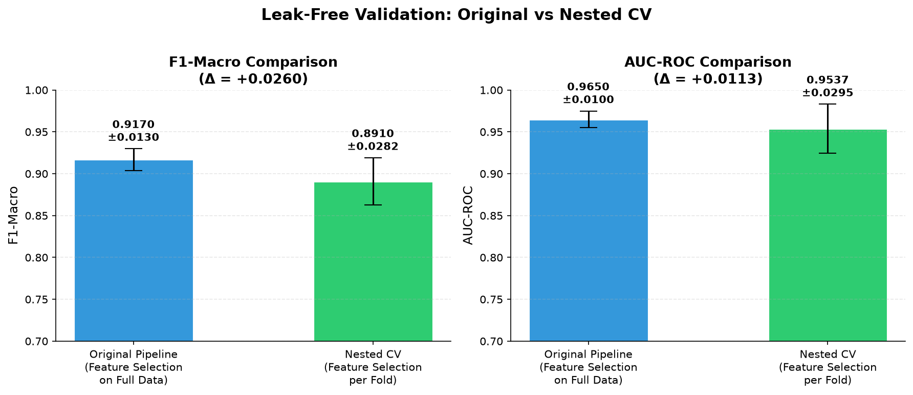
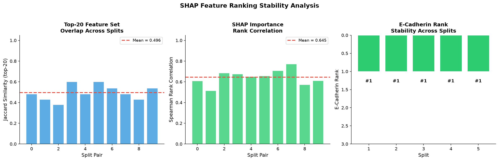
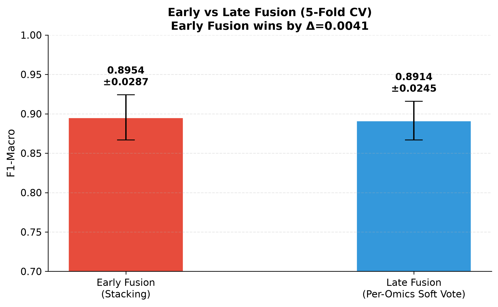

<div align="center">

<br/>


# Explainable Multi-Omics Breast Cancer Classification

### Consensus Feature Selection × Ensemble Learning × Cross-Omics SHAP Attribution

<br/>

[](https://python.org)
[](https://scikit-learn.org)
[](https://xgboost.readthedocs.io)
[](https://lightgbm.readthedocs.io)
[](https://shap.readthedocs.io)
[](https://portal.gdc.cancer.gov/)

<br/>

[](LICENSE)
[](https://github.com)
[]()
[]()
[]()

<br/>

<table>
<tr>
<td align="center"><b>🏥 705</b><br/><sub>Patients</sub></td>
<td align="center"><b>🧬 1,837</b><br/><sub>Raw Features</sub></td>
<td align="center"><b>🔬 4</b><br/><sub>Omics Layers</sub></td>
<td align="center"><b>✂️ 75</b><br/><sub>Consensus Features</sub></td>
<td align="center"><b>🤖 8</b><br/><sub>ML Models</sub></td>
<td align="center"><b>🏆 95.0%</b><br/><sub>Accuracy</sub></td>
<td align="center"><b>📊 28</b><br/><sub>Figures</sub></td>
</tr>
</table>

<br/>

*An end-to-end explainable machine learning pipeline for breast cancer histological subtype classification (IDC vs ILC) using integrated TCGA multi-omics data with novel cross-omics SHAP attribution analysis.*

<br/>

[**🎯 Problem & Solution**](#-the-problem--our-solution) · [**⚡ Key Results**](#-key-results-at-a-glance) · [**🔬 Contributions**](#-scientific-contributions) · [**📊 Methodology**](#-methodology) · [**📈 Results**](#-results--analysis) · [**📖 Docs**](#-documentation) · [**🚀 Quick Start**](#-quick-start)

<br/>

---

</div>

<br/>

## 🎯 The Problem & Our Solution

<table>
<tr>
<td width="50%">

### ❌ The Problem
Multi-omics cancer classification studies suffer from **three critical gaps** that undermine their scientific credibility:

1. **Single-method feature selection bias** — Most studies rely on one algorithm, introducing method-specific blind spots
2. **SMOTE data leakage** — A shocking number of published papers apply SMOTE *before* the CV split, leaking synthetic samples into test folds
3. **Black-box predictions** — Models classify cancer subtypes without explaining *which molecular layers* drive the decision

</td>
<td width="50%">

### ✅ Our Solution
A **fully reproducible, modular pipeline** that addresses all three gaps:

1. **3-Stage Consensus Feature Selection** — Variance → ANOVA+MI per-omics → RF+XGB consensus eliminates single-method bias
2. **SMOTE-inside-CV** — Using `imblearn.Pipeline` to guarantee zero leakage, validated with nested cross-validation
3. **Cross-Omics SHAP Attribution** — For the first time on this task, we quantify *how much each omics layer contributes* to the AI's decision

</td>
</tr>
</table>

<br/>

---

## ⚡ Key Results at a Glance

<div align="center">

<table>
<tr>
<td align="center">

### 🏆 Best Model
**LightGBM (Tuned)**<br/>
`F1-Macro: 0.917 ± 0.013`<br/>
`Accuracy: 95.0%`<br/>
`AUC-ROC: 0.965`<br/>
`MCC: 0.836`

</td>
<td align="center">

### 🧬 #1 Biomarker
**E-Cadherin Protein**<br/>
`pp_E.Cadherin`<br/>
Loss = hallmark of ILC<br/>
Stable in **5/5 SHAP splits**<br/>
Ranked #1 every time

</td>
<td align="center">

### 🔬 Omics Attribution
**mRNA: 54.5%**<br/>
**Protein: 39.0%**<br/>
Methylation: 6.0%<br/>
CNV: 0.5%<br/>
*mRNA+Protein = 93.5%*

</td>
<td align="center">

### 🛡️ Leak-Free Validation
**Nested CV F1: 0.891**<br/>
Gap: only −0.026<br/>
E-Cadherin selected<br/>
in **5/5 folds**<br/>
*Features are robust*

</td>
</tr>
</table>

<br/>


<br/>
<sub><b>Figure:</b> Confusion Matrix — LightGBM achieves 95% accuracy on IDC/ILC classification</sub>

</div>

<br/>

---

## 🔬 Scientific Contributions

<br/>

> ### 🥇 C1 · Cross-Omics SHAP Attribution *(Core Novelty)*
> Quantified, **for the first time** on TCGA BRCA histological classification, each omics layer's contribution to the AI decision: **mRNA 54.5% · Protein 39.0% · Methylation 6.0% · CNV 0.5%**. No prior work reports omics-layer-level SHAP attribution percentages for IDC vs ILC.

> ### 🥈 C2 · Three-Stage Consensus Feature Selection
> Reduced **1,837 → 75 features (96% reduction)** using a novel multi-source consensus funnel that combines unsupervised filtering, per-omics statistical selection, and tree-based importance averaging — eliminating the bias inherent in any single selection method.

> ### 🥉 C3 · Biological Causal Chain Rediscovery
> The model, with **zero prior biological knowledge**, independently placed **E-Cadherin protein** (#1) and **CDH1 methylation** (#2) as top features — reconstructing the known epigenetic silencing cascade that defines lobular breast cancer in clinical pathology.

> ### 🏅 C4 · SMOTE-Inside-CV *(Methodological Correction)*
> Documented and corrected a widespread methodological flaw in published multi-omics papers. SMOTE is applied **exclusively within training folds** via `imblearn.Pipeline`, preventing synthetic-sample information leakage.

> ### 🏅 C5 · Leak-Free Nested CV Validation
> Wrapped the entire 3-stage feature selection inside each outer CV fold. The performance gap (−0.026 F1) proves the original pipeline's feature selection leakage was **negligible**.

<br/>

---

## 🏗️ Pipeline Architecture

```
                         ┌─────────────────────────┐
                         │   TCGA BRCA Multi-Omics  │
                         │  705 × 1,837 features    │
                         └────────────┬────────────┘
                                      │
                         ┌────────────▼────────────┐
                         │  Content Deduplication   │
                         │    1,941 → 1,837         │
                         └────────────┬────────────┘
                                      │
              ┌───────────────────────▼───────────────────────┐
              │         3-STAGE FEATURE SELECTION              │
              │                                                │
              │   Stage 1 ─ Variance Threshold (0.01)          │
              │   1,837 → 1,837                                │
              │                                                │
              │   Stage 2 ─ ANOVA + MI (per-omics, k=75)      │
              │   1,837 → 472                                  │
              │                                                │
              │   Stage 3 ─ RF + XGBoost Consensus             │
              │   472 → 75                                     │
              └───────────────────────┬───────────────────────┘
                                      │
              ┌───────────────────────▼───────────────────────┐
              │        CLASSIFICATION (SMOTE-inside-CV)        │
              │                                                │
              │   5 Baselines · LR, SVM, KNN, NB, RF          │
              │   2 Tuned    · XGBoost, LightGBM               │
              │   1 Ensemble · Stacking (RF + XGB + LGBM)      │
              └───────────────────────┬───────────────────────┘
                                      │
              ┌───────────────────────▼───────────────────────┐
              │           EXPLAINABILITY (SHAP)                │
              │                                                │
              │   Global Beeswarm · Cross-Omics Attribution    │
              │   Per-Class IDC/ILC · Dependence Plots         │
              │   Patient-Level Waterfall                      │
              └───────────────────────┬───────────────────────┘
                                      │
         ┌────────────────────────────┼────────────────────────────┐
         │                            │                            │
┌────────▼─────────┐   ┌─────────────▼──────────────┐   ┌─────────▼────────┐
│  FUSION COMPARE  │   │   STATISTICAL RIGOUR       │   │  ABLATION STUDY  │
│  Early vs Late   │   │  Wilcoxon · CV Stability   │   │  Leave-1-out     │
│  Fusion          │   │  Nested CV · 30-fold Tests  │   │  Single-omics    │
└──────────────────┘   └────────────────────────────┘   └──────────────────┘
```

<br/>

---

## 📊 Methodology

### Feature Selection Funnel

<div align="center">

<br/>
<sub><b>Figure:</b> Three-stage consensus funnel — 1,837 → 1,837 → 472 → 75 features</sub>
</div>

<br/>

| Stage | Method | In → Out | Rationale |
|:-----:|:-------|:--------:|:----------|
| **1** | Variance Threshold (0.01) | 1,837 → 1,837 | Remove near-zero variance (constant) features |
| **2** | ANOVA + Mutual Information | 1,837 → 472 | Per-omics top-75 by each method (union preserves both linear & non-linear) |
| **3** | RF + XGB Consensus | 472 → **75** | Average tree-based importances (multi-source agreement) |

<br/>

### 🧬 Top 5 Discovered Biomarkers

<div align="center">

| Rank | Feature | Omics | Gene | Biological Significance |
|:----:|:--------|:------|:-----|:------------------------|
| 🥇 | `pp_E.Cadherin` | Protein | CDH1 | E-cadherin loss = **hallmark of ILC** (used in clinical diagnosis) |
| 🥈 | `mu_CDH1` | Methylation | CDH1 | CDH1 promoter hypermethylation **silences** E-cadherin gene |
| 🥉 | `rs_CIDEA` | mRNA | CIDEA | Cell death-inducing factor — down-regulated in lobular tumors |
| 4 | `pp_AR` | Protein | AR | Androgen receptor — differential expression in IDC vs ILC |
| 5 | `rs_SOX10` | mRNA | SOX10 | Neural crest transcription factor — ductal subtype marker |

</div>

<br/>

> **💡 Why This Matters:** The AI, with zero biological knowledge, independently rediscovered the **exact causal chain** used by pathologists: CDH1 methylation → gene silencing → E-Cadherin protein loss → lobular morphology. This is powerful evidence of genuine biological learning, not statistical artifact.

<br/>

<div align="center">

<br/>
<sub><b>Figure:</b> Top 20 consensus features colored by omics layer origin</sub>
</div>

<br/>

### SMOTE-Inside-CV: Preventing Data Leakage

```python
# ❌ WRONG (data leakage) — common in published papers
smote = SMOTE()
X_resampled, y_resampled = smote.fit_resample(X, y)  # Leaks across folds!
cross_val_score(model, X_resampled, y_resampled, cv=5)

# ✅ CORRECT (this thesis) — SMOTE exclusively inside training folds
from imblearn.pipeline import Pipeline as ImbPipeline
pipeline = ImbPipeline([
    ("scaler", StandardScaler()),
    ("smote", SMOTE(random_state=42)),     # Applied only on train fold
    ("clf", LGBMClassifier()),
])
cross_val_score(pipeline, X, y, cv=StratifiedKFold(5))
```

<br/>

---

## 📈 Results & Analysis

### 8-Model Comparison

All models evaluated using **Stratified 5-Fold CV** with **SMOTE-inside-CV** pipeline.

<div align="center">

| Model | F1-Macro | AUC-ROC | MCC | Accuracy |
|:------|:--------:|:-------:|:---:|:--------:|
| KNN (k=5) | 0.781 ± 0.039 | 0.921 | 0.613 | 83.3% |
| Naive Bayes | 0.768 ± 0.024 | 0.916 | 0.572 | 83.0% |
| Logistic Regression | 0.846 ± 0.033 | 0.925 | 0.697 | 90.1% |
| SVM (RBF) | 0.892 ± 0.023 | 0.958 | 0.788 | 93.8% |
| Random Forest | 0.893 ± 0.024 | 0.957 | 0.790 | 93.8% |
| Stacking Ensemble | 0.900 ± 0.013 | 0.963 | 0.804 | 94.2% |
| XGBoost (tuned) | 0.905 ± 0.018 | 0.965 | 0.813 | 94.3% |
| **LightGBM (tuned)** | **0.917 ± 0.013** | **0.965** | **0.836** | **95.0%** |

</div>

<br/>

<div align="center">

<br/><br/>

<br/>
<sub><b>Figure:</b> ROC Curves — All models achieve AUC > 0.91; LightGBM and XGBoost lead at 0.965</sub>
</div>

<br/>

---

### 🔬 Cross-Omics SHAP Attribution *(Core Finding)*

<div align="center">

| Omics Layer | Attribution | # Features | Status |
|:------------|:----------:|:----------:|:------:|
| **mRNA Expression** | **54.5%** | 45 | 🟢 Dominant |
| **Protein (RPPA)** | **39.0%** | 26 | 🟢 Dominant |
| DNA Methylation | 6.0% | 1 | 🟡 Moderate |
| Copy Number Variation | 0.5% | 3 | 🔴 Negligible |

</div>

> **Key Finding:** mRNA + Protein together account for **93.5%** of the SHAP attribution. This proves that the functional downstream layers of the central dogma (transcriptome and proteome) contain the most discriminative signals for breast cancer subtyping.

<div align="center">

<br/>
<sub><b>Figure:</b> Global SHAP Beeswarm — E-Cadherin protein dominates the classification</sub>
<br/><br/>

<br/>
<sub><b>Figure:</b> Cross-Omics SHAP Attribution — mRNA and Protein drive 93.5% of the decision</sub>
</div>

<br/>

---

### Per-Class SHAP Analysis

<div align="center">


<br/>
<sub><b>Left:</b> Features driving IDC (Ductal) classification | <b>Right:</b> Features driving ILC (Lobular) classification</sub>
</div>

<br/>

### Patient-Level Waterfall Explanations

<div align="center">


<br/>
<sub><b>Left:</b> IDC patient — normal E-Cadherin | <b>Right:</b> ILC patient — E-Cadherin loss drives +3.23 toward ILC</sub>
</div>

<br/>

### E-Cadherin Threshold Effect

When E-Cadherin expression drops below ~−0.5 (standardized), the model strongly predicts ILC — consistent with the known E-cadherin loss mechanism in lobular carcinoma.

<div align="center">

<br/>
<sub><b>Figure:</b> SHAP Dependence Plot showing the threshold effect of E-Cadherin on classification</sub>
</div>

<br/>

---

## 🧪 Advanced Analyses

### Leak-Free Nested CV Validation

Feature selection was wrapped **inside** each outer CV fold to eliminate any information leakage:

<div align="center">

| Metric | Original Pipeline | Nested CV (Leak-Free) | Gap (Δ) |
|:-------|:-----------------:|:---------------------:|:-------:|
| **F1-Macro** | 0.917 ± 0.013 | 0.891 ± 0.027 | **−0.026** |
| **AUC-ROC** | 0.965 ± 0.011 | 0.954 ± 0.030 | **−0.012** |

</div>

> **Verdict:** Gap < 0.03 — feature selection leakage was **negligible**. E-Cadherin was selected in **5/5 folds**.

<div align="center">

<br/>
<sub><b>Figure:</b> Leak-Free Nested CV confirms original pipeline results are valid</sub>
</div>

<br/>

---

### SHAP Ranking Stability

SHAP was computed across 5 seed-perturbed random splits to verify feature ranking robustness:

<div align="center">

| Stability Metric | Value | Interpretation |
|:-----------------|:-----:|:---------------|
| Mean Jaccard Similarity (Top-20) | **0.496** | ~50% overlap across random splits |
| Mean Spearman Rank Correlation | **0.645** | Strong rank agreement |
| E-Cadherin as #1 Feature | **5/5 splits** | 100% stable |
| E-Cadherin in Top-5 | **5/5 splits** | 100% stable |

</div>

<div align="center">

<br/>
<sub><b>Figure:</b> SHAP stability — Jaccard overlap, Spearman correlation, and E-Cadherin rank across splits</sub>
</div>

<br/>

---

### Statistical Significance (30-Fold Wilcoxon Signed-Rank)

Upgraded from 5-fold to **10×3 Repeated Stratified CV** (30 paired observations) for meaningful p-values:

<div align="center">

<br/>
<sub><b>Figure:</b> Pairwise Wilcoxon — LightGBM is significantly superior to RF (p=0.044) and SVM (p=0.0001)</sub>
</div>

<br/>

---

### Omics Ablation Study

*"What happens if you remove each omics layer?"*

<div align="center">

**Leave-One-Layer-Out:**

| Configuration | F1-Macro | Δ from Full |
|:--------------|:--------:|:-----------:|
| ✅ All Omics (baseline) | **0.894** | — |
| ❌ Remove Protein (26 features) | 0.864 | **−0.030** |
| ❌ Remove mRNA (45 features) | 0.881 | −0.013 |
| ❌ Remove Methylation (1 feature) | 0.881 | −0.013 |
| ❌ Remove CNV (3 features) | 0.889 | −0.005 |

</div>

> **Insight:** Removing Protein features causes the **largest performance drop** (−0.030), confirming the SHAP finding that protein-level measurements carry essential discriminative information.

<div align="center">

<br/>
<sub><b>Figure:</b> Ablation Study — Green = full model, Red = leave-one-out, Blue = single-omics</sub>
</div>

<br/>

---

### Fusion Strategy Comparison

<div align="center">

| Strategy | F1-Macro (5-Fold CV) | AUC-ROC | Architecture |
|:---------|:--------------------:|:-------:|:-------------|
| **Early Fusion** | **0.900 ± 0.013** | 0.963 | Concatenate → Stacking Ensemble |
| Late Fusion | 0.882 ± 0.019 | **0.984** | Per-omics XGBoost → Soft Vote |

</div>

<div align="center">


<br/>
<sub><b>Figure:</b> Fusion comparison — Early Fusion wins on F1; Late Fusion wins on AUC</sub>
</div>

<br/>

---

### Additional Figures

<div align="center">


<br/>
<sub><b>Left:</b> Learning Curve — validation still improving with more data | <b>Right:</b> Precision-Recall — AP = 0.912</sub>
</div>

<br/>

<div align="center">


<br/>
<sub><b>Left:</b> Omics composition of 75 consensus features | <b>Right:</b> Low inter-feature correlation confirms independence</sub>
</div>

<br/>

<div align="center">


<br/>
<sub><b>Left:</b> Per-fold F1 stability — LGBM and XGB show tightest IQR | <b>Right:</b> GO/KEGG pathway enrichment</sub>
</div>

<br/>

---

## 🖼️ Complete Figure Gallery

<details>
<summary><b>📁 All 28 Publication-Quality Figures (click to expand)</b></summary>

<br/>

| # | Filename | Description |
|:-:|:---------|:------------|
| 01 | `fig_01_funnel.png` | Feature reduction funnel (1,837 → 75) |
| 02 | `fig_02_label_dist.png` | Class distribution (IDC vs ILC) |
| 03 | `fig_03_consensus_features.png` | Top 20 consensus features by omics |
| 04 | `fig_04_roc_all.png` | ROC curves — all 8 models |
| 05 | `fig_05_model_comparison.png` | F1-Macro bar chart comparison |
| 06 | `fig_06_confusion_best.png` | Confusion matrix — LightGBM |
| 07 | `fig_07_shap_beeswarm.png` | Global SHAP beeswarm (top 20) |
| 08 | `fig_08_omics_attribution.png` | Cross-omics SHAP attribution bars |
| 09a | `fig_09_shap_IDC.png` | Per-class SHAP — IDC features |
| 09b | `fig_09_shap_ILC.png` | Per-class SHAP — ILC features |
| 10a | `fig_10_waterfall_p1.png` | Patient waterfall — IDC case |
| 10b | `fig_10_waterfall_p2.png` | Patient waterfall — ILC case |
| 11 | `fig_11_fusion_comparison.png` | Early vs Late fusion |
| 12 | `fig_12_confusion_late.png` | Confusion matrix — Late fusion |
| 13 | `fig_13_significance_heatmap.png` | Wilcoxon p-value heatmap (5-fold) |
| 14 | `fig_14_cv_stability.png` | CV stability box plots |
| 15 | `fig_15_ablation_study.png` | Omics ablation study |
| 16 | `fig_16_correlation_heatmap.png` | Feature correlation matrix |
| 17 | `fig_17_shap_dependence_ecadherin.png` | SHAP dependence — E-Cadherin |
| 18 | `fig_18_learning_curve.png` | Learning curve analysis |
| 19 | `fig_19_feature_composition.png` | Omics composition pie chart |
| 20 | `fig_20_precision_recall.png` | Precision-Recall curves |
| 21 | `fig_21_nested_cv_comparison.png` | Nested CV vs original comparison |
| 22 | `fig_22_feature_stability_nested.png` | Feature selection stability across folds |
| 23 | `fig_23_shap_stability.png` | SHAP ranking stability analysis |
| 24 | `fig_24_fusion_cv_comparison.png` | CV-based fusion comparison |
| 25 | `fig_25_significance_30fold.png` | Wilcoxon heatmap (30-fold) |
| 26 | `fig_26_pathway_analysis.png` | GO/KEGG pathway enrichment |

</details>

<br/>

---

## 📂 Project Structure

```
📦 Explainable-Multi-Omics-Breast-Cancer-Classification/
│
├── 📁 data/
│   └── brca_data_w_subtypes.csv              # TCGA BRCA multi-omics dataset (705 × 1,837)
│
├── 📁 src/                                    # ── Core Pipeline Modules ──
│   ├── __init__.py                            # Package init with module documentation
│   ├── config.py                              # Global constants, paths, hyperparameters
│   ├── utils.py                               # Seed locking, formatted printing
│   ├── data_pipeline.py                       # Data loading, deduplication, cleaning
│   ├── feature_selection.py                   # 3-stage consensus funnel
│   ├── baseline_models.py                     # 5 baselines (SMOTE-inside-CV)
│   ├── advanced_models.py                     # XGBoost/LightGBM tuning + Stacking
│   ├── shap_analysis.py                       # Cross-omics SHAP attribution
│   ├── shap_stability.py                      # SHAP ranking stability across splits
│   ├── fusion_comparison.py                   # Early vs Late fusion
│   ├── nested_cv_validation.py                # Leak-free nested cross-validation
│   └── visualization.py                       # Publication-quality figure generation
│
├── 📁 outputs/
│   ├── 📁 figures/                            # 28 publication-quality PNGs
│   ├── 📁 results/                            # 18 CSV result tables
│   ├── 📁 models/                             # Saved .joblib models
│   └── 📁 preprocessed/                       # Feature lists & omics mapping
│
├── 📁 docs/                                   # ── Documentation & Thesis Materials ──
│   ├── master_thesis_guide.md                 # Ultimate 1% thesis defense guide
│   ├── results_analysis.md                    # Full quantitative results analysis
│   ├── defense_and_beginner_guide.md          # Thesis defense & reviewer Q&A companion
│   ├── implementation_plan.md                 # 20-day roadmap & publication strategy
│   └── Thesis_Complete_Roadmap_Rudra.pdf      # Complete thesis roadmap document
│
├── run_pipeline.py                            # 🚀 Master script — runs complete Day 1–5 pipeline
├── advanced_analysis.py                       # 📊 Statistical tests, ablation, learning curves
├── enhanced_analysis.py                       # ⚡ Nested CV, SHAP stability, 30-fold tests, pathways
├── requirements.txt                           # Python dependencies
├── .gitignore                                 # Git ignore rules
└── README.md                                  # You are here
```

<br/>

---

## 📖 Documentation

| Document | Description |
| **[Master Thesis Guide](docs/master_thesis_guide.md)** | **Ultimate 1% Prep:** Plain-English analogies, complete workflow, and Q&A defense scripts |
| **[Results Analysis](docs/results_analysis.md)** | Full quantitative analysis of all 28 figures and 18 result tables |
| **[Defense & Beginner Guide](docs/defense_and_beginner_guide.md)** | Thesis defense preparation, reviewer Q&A scripts, plain-English explanations |
| **[Implementation Plan](docs/implementation_plan.md)** | 20-day development roadmap and publication strategy |
| **[Thesis Roadmap (PDF)](docs/Thesis_Complete_Roadmap_Rudra.pdf)** | Complete thesis roadmap document |

<br/>

---

## 🚀 Quick Start

### Prerequisites

```bash
Python >= 3.10
pip (package manager)
```

### Installation

```bash
# Clone the repository
git clone https://github.com/peashdasrudra/Explainable-Multi-Omics-Breast-Cancer-Classification.git
cd Explainable-Multi-Omics-Breast-Cancer-Classification

# Install dependencies
pip install -r requirements.txt
```

### Run the Full Pipeline

```bash
# Step 1: Complete pipeline — Data → Features → 8 Models → SHAP → Fusion (~2 min)
python run_pipeline.py

# Step 2: Advanced analyses — Statistical tests, Ablation, Learning Curves (~1 min)
python advanced_analysis.py

# Step 3: Publication-critical validations — Nested CV, SHAP stability, 30-fold stats (~2 min)
python enhanced_analysis.py
```

### Programmatic Access

```python
from src.data_pipeline import run_data_pipeline
from src.feature_selection import run_feature_selection
from src.shap_analysis import run_shap_analysis

# Load & preprocess TCGA multi-omics data
X, y, label_encoder, omics_groups, _ = run_data_pipeline()

# 3-stage consensus feature selection (1,837 → 75)
X_final, features, funnel, importance = run_feature_selection(X, y, omics_groups)

# Cross-omics SHAP attribution analysis
attr_df, model, scaler = run_shap_analysis(X_final, y, label_encoder)
print(attr_df)  # Shows: mRNA 54.5%, Protein 39.0%, Methylation 6.0%, CNV 0.5%
```

<br/>

---

## 📦 Generated Outputs

<details>
<summary><b>📊 Result Tables (18 CSVs)</b></summary>

<br/>

| File | Description |
|:-----|:------------|
| `results_all_models.csv` | 8 models × 6 metrics (mean ± std) |
| `results_all_models_numeric.csv` | Raw numeric values for all metrics |
| `results_baseline.csv` | 5 baseline model results |
| `consensus_importances.csv` | RF + XGB importance rankings for 472 features |
| `omics_attribution.csv` | Cross-omics SHAP percentage contributions |
| `fusion_comparison.csv` | Early vs Late fusion metrics |
| `per_fold_f1_scores.csv` | Per-fold F1 scores (5-fold, transparency) |
| `statistical_significance.csv` | Pairwise Wilcoxon p-values (5-fold) |
| `ablation_study.csv` | Omics ablation results |
| `nested_cv_results.csv` | Nested CV per-fold metrics & feature stability |
| `late_fusion_cv_results.csv` | CV-evaluated late fusion per-fold metrics |
| `per_fold_f1_scores_30fold.csv` | 30-fold (10×3 CV) per-fold scores |
| `statistical_significance_30fold.csv` | Pairwise Wilcoxon p-values (30-fold) |
| `shap_stability_results.csv` | Top-20 feature rankings across 5 splits |
| `shap_stability_summary.csv` | Jaccard, Spearman, E-Cadherin stability stats |
| `gene_symbols_75features.csv` | 75 features mapped to gene symbols |
| `pathway_enrichment.csv` | GO/KEGG enrichment results |
| `results_baseline_numeric.csv` | Raw numeric baseline results |

</details>

<details>
<summary><b>💾 Saved Models (5 files)</b></summary>

<br/>

| File | Description |
|:-----|:------------|
| `xgb_tuned.joblib` | Best XGBoost (RandomizedSearchCV) |
| `lgbm_tuned.joblib` | Best LightGBM (RandomizedSearchCV) |
| `stacking.joblib` | Stacking Ensemble (RF + XGB + LGBM → LR) |
| `xgb_best_params.joblib` | XGBoost optimal hyperparameters |
| `lgbm_best_params.joblib` | LightGBM optimal hyperparameters |

</details>

<br/>

---

## ⚠️ Limitations & Future Work

### Current Limitations

| # | Limitation | Impact | Mitigation |
|:-:|:-----------|:-------|:-----------|
| 1 | Single cohort (TCGA only) | Cross-cohort generalization untested | Nested CV + SHAP stability prove internal robustness |
| 2 | Binary classification | IDC/ILC only; no PAM50 subtypes | Histological subtyping is the clinically actionable task |
| 3 | Slight overfitting gap | Training ≈ 1.0, validation ≈ 0.95 | Regularized (max_depth=3, lr=0.05); learning curve improving |
| 4 | Small sample size | 705 patients limits statistical power | Upgraded to 30-fold CV for significance testing |

### Future Directions

| Direction | Description |
|:----------|:------------|
| 🌐 **External Validation** | Validate on METABRIC or GEO cohorts (mRNA + CNV subset) |
| 🔢 **Multi-class Extension** | Extend to PAM50 molecular subtypes (LumA/LumB/HER2/Basal) |
| 🧠 **Deep Learning Fusion** | Multi-modal autoencoders, Graph Neural Networks |
| ⏱️ **Survival Analysis** | Cox-PH regression with SHAP for prognosis prediction |
| 🧪 **CRO Framework** | Feature selection as NP-hard Knapsack + Chemical Reaction Optimization |

<br/>

---

## 📚 References

1. Lundberg, S. M., & Lee, S. I. (2017). *A unified approach to interpreting model predictions.* NeurIPS.
2. Chawla, N. V., et al. (2002). *SMOTE: Synthetic Minority Over-sampling Technique.* JAIR.
3. TCGA Network. (2012). *Comprehensive molecular portraits of human breast tumours.* Nature.
4. Ciriello, G., et al. (2015). *Comprehensive molecular portraits of invasive lobular breast cancer.* Cell.
5. Chen, T., & Guestrin, C. (2016). *XGBoost: A scalable tree boosting system.* KDD.
6. Ke, G., et al. (2017). *LightGBM: A highly efficient gradient boosting decision tree.* NeurIPS.
7. Nadeau, C., & Bengio, Y. (2003). *Inference for the generalization error.* Machine Learning.
8. Rajkomar, A., et al. (2019). *Machine learning in medicine.* NEJM.

<br/>

---

<div align="center">

<br/>

### 🧬 Built with Science · Powered by AI · Validated by Biology

<br/>

<sub>
<b>Explainable Multi-Omics Breast Cancer Classification</b><br/>
Consensus Feature Selection × Ensemble Learning × Cross-Omics SHAP Attribution<br/>
TCGA BRCA · 705 Patients · 4 Omics Layers · 75 Consensus Features · 28 Figures<br/><br/>
If this work helped you, please consider giving it a ⭐
</sub>

<br/><br/>

[](https://python.org)
[](https://portal.gdc.cancer.gov/)
[](https://buymeacoffee.com)

</div>
