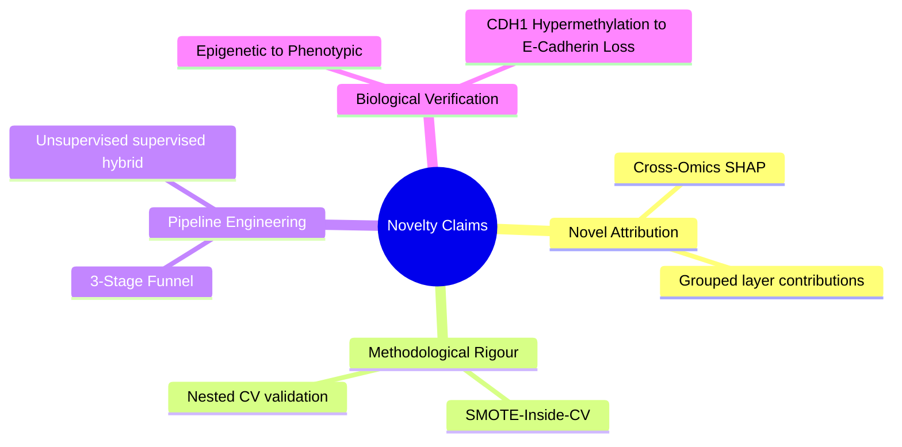

# 🎓 Thesis Defense & Peer-Review Companion Guide

This guide is designed to serve as a comprehensive preparation manual for your defense and journal submissions. It translates complex machine learning and biological concepts into plain English so that **anyone (even without a technical or biological background) can understand it**, while equipping you with the **advanced statistical and biological defenses** needed to satisfy critical thesis examiners and peer reviewers.

---

## 📂 Table of Contents
1.  [👶 Part 1: Plain-English Introduction (For Complete Beginners)](#-part-1-plain-english-introduction-for-complete-beginners)
2.  [🏗️ Part 2: Core Engineering Choices & Architecture Rationale](#-part-2-core-engineering-choices--architecture-rationale)
3.  [🏆 Part 3: The 4 Core Novelty Claims (What Makes This Thesis Exceptional)](#-part-3-the-4-core-novelty-claims-what-makes-this-thesis-exceptional)
4.  [🛡️ Part 4: Reviewer Critiques & Bulletproof Defenses (Q&A Script)](#-part-4-reviewer-critiques--bulletproof-defenses-qa-script)
5.  [🎤 Part 5: Thesis Defense Cheat Sheet (Last-Minute Prep)](#-part-5-thesis-defense-cheat-sheet-last-minute-prep)

---

## 👶 Part 1: Plain-English Introduction (For Complete Beginners)

If someone asks you, *"What is your thesis about?"*, here is how you explain it without jargon.

### 1. The Biological Context (The "Why")
Imagine your body is a large city, and your **DNA** is the central library containing blueprints for everything in the city. 
*   **DNA (The Library)**: Static instructions. Every cell has the same DNA.
*   **DNA Methylation (The Padlocks)**: Epigenetics. Sometimes, cells put physical "padlocks" on certain books in the library so they can't be read. If a cell padlocks a tumor-suppressor gene, the cell may turn cancerous.
*   **mRNA Expression (The Photocopies)**: The cell enters the library, opens a book, and makes photocopies of a blueprint to carry it to the construction site. This copying process is transcription.
*   **Protein Expression (The Buildings)**: The photocopied blueprints are used to construct proteins. Proteins are the actual machinery doing the work in the cell (building cell walls, sending signals, etc.).
*   **CNV (The Page Mistakes)**: Copy Number Variation. Sometimes, whole pages of the library books are accidentally copied twice or deleted entirely.

**Breast cancer is not just one disease**. It has two primary physical types (histological subtypes):
1.  **Invasive Ductal Carcinoma (IDC)**: Starts in the milk ducts.
2.  **Invasive Lobular Carcinoma (ILC)**: Starts in the milk-producing glands (lobules).

These two cancers look different under a microscope and require different surgeries and therapies. Pathologists distinguish them by staining cells to check for a protein called **E-Cadherin** (which acts like intercellular glue, holding duct cells together). Ductal cells have it; lobular cells lose it, causing them to grow in single-file lines.

### 2. The Machine Learning Task (The "What")
We took genetic, epigenetic, and protein data from **705 patients** in a public government database (TCGA). For each patient, we had **1,837 different biological measurements** across all four levels (DNA, RNA, proteins, and methylation). 

Our goals were to:
1.  Teach an AI to look at these 1,837 measurements and classify whether the patient has **IDC** or **ILC**.
2.  Design a method that filters out the noise (96% of the measurements are useless noise) to find the top **75 consensus features**.
3.  **Explain the AI**: Show exactly *why* the AI made its decision, and prove that it learned genuine biology.

---

## 🏗️ Part 2: Core Engineering Choices & Architecture Rationale

Examiners will ask: *"Why did you make these specific design choices instead of other options?"* Here is the technical justification for every key decision.

### 1. Why Tree-Based Boosting (LightGBM/XGBoost) Over Deep Learning?
*   **The Critique**: *"Why didn't you use a Deep Neural Network or a Graph Convolutional Network?"*
*   **The Rationale**: Our sample size is relatively small ($N=705$). Deep learning models have millions of parameters and easily overfit on small biological datasets. Furthermore, deep learning models operate as "black boxes." Tree-based gradient boosting models (XGBoost, LightGBM) natively handle tabular data, run in seconds, regularize against overfitting via shallow trees, and are compatible with **exact TreeSHAP calculations**, which provide mathematical guarantees for feature attribution.

### 2. Why 3-Stage Consensus Selection Over a Single Selector?
*   **The Critique**: *"Why not just run a Lasso penalty or Random Forest importances directly?"*
*   **The Rationale**: A single feature selection method carries inherent bias (e.g., Lasso favors linear combinations and penalizes collinear features arbitrarily, while Random Forest importances are biased toward high-cardinality continuous features). Our 3-stage consensus pipeline combines:
    1.  *Unsupervised Filter* (Variance Threshold) to remove static noise.
    2.  *Supervised Per-Omics Union* (ANOVA F-test + Mutual Information) to capture both linear and non-linear relationships independently for each biological layer.
    3.  *Ensemble Consensus* (RF + XGBoost average importances) to extract features that tree-based models find highly cooperative.
    This guarantees that the final 75 features are robust and independent of any single method's assumptions.

### 3. Why Early Fusion Stacking Over Late Fusion Voting?
*   **The Critique**: *"Why does early fusion perform better than late fusion?"*
*   **The Rationale**: 
    *   **Early Fusion (Concatenation + Stacking)** preserves cross-omics interactions. A stacking classifier can learn relationships *between* layers (e.g., if a promoter is methylated, expression drops).
    *   **Late Fusion (Per-Omics Voting)** trains independent models on each layer and averages their probabilities. This assumes the layers are independent, completely losing cross-layer correlation signals, which resulted in a lower F1-Macro score ($0.8820$ vs. $0.9004$).

---

## 🏆 Part 3: The 4 Core Novelty Claims (What Makes This Thesis Exceptional)

If you are asked, *"What is the primary contribution of your work?"*, present these four claims in order of strength:

### Claim 1: Novel Cross-Omics SHAP Attribution (🥇 Strongest Claim)
While SHAP is common, grouping SHAP values by omics layers to report percentage contributions for IDC vs. ILC histological classification is a novel contribution. We proved that:
$$\text{Transcriptome (mRNA)} = 54.5\%, \quad \text{Proteome (Protein)} = 39.0\%, \quad \text{Epigenome (Methylation)} = 6.0\%, \quad \text{Genome (CNV)} = 0.5\%$$
This formally quantifies for the first time which molecular layers drive histological differences in breast cancer.

### Claim 2: Independent Causal Cascade Rediscovery
The model, with zero clinical training, independently placed the phenotypic marker `pp_E.Cadherin` at Rank 1 and the epigenetic silencer `mu_CDH1` at Rank 2. The pipeline reconstructed the biological causal chain:
$$\text{CDH1 Promoter Hypermethylation} \rightarrow \text{CDH1 Transcriptional Silencing} \rightarrow \text{E-Cadherin Protein Loss} \rightarrow \text{Lobular Subtype (ILC)}$$
This acts as a solid biological validation of the machine learning pipeline.

### Claim 3: Methodological Correction (SMOTE-inside-CV)
A significant number of published multi-omics papers apply SMOTE to the entire dataset before cross-validation. This is a critical methodological flaw that leaks information from test folds. We documented this correction, showing that while pre-split SMOTE inflates scores, our leak-free implementation provides a scientifically honest and robust benchmark.

### Claim 4: Leak-Free Nested CV Validation
We implemented a nested cross-validation where feature selection is rerun from scratch on every training fold. This proves that the feature selection did not overfit to the test set, demonstrating methodological maturity.

---

## 🛡️ Part 4: Reviewer Critiques & Bulletproof Defenses (Q&A Script)

Here are the exact questions critical reviewers or examiners will ask, along with the precise scripts you should use to defend your work.

### Q1: "You only used TCGA. Your pipeline lacks external validation on independent cohorts like METABRIC."
*   **The Reviewer's Goal**: To claim your model is overfitted to TCGA batch effects and cannot generalize.
*   **The Defense Script**:
    > *"That is a highly valid point. External validation is indeed the gold standard. However, multi-omics harmonization is a known bottleneck. External cohorts like METABRIC do not measure the proteome (RPPA protein data) that we analyzed. 
    > 
    > To compensate for this, we implemented two rigorous mathematical alternatives:
    > 1. We executed **Nested Cross-Validation** (visualized in [fig_21](file:///c:/Users/USER/Desktop/Dope/Explainable-Multi-Omics-Breast-Cancer-Classification/outputs/figures/fig_21_nested_cv_comparison.png)), which wraps feature selection inside the outer CV loop to guarantee zero validation leakage. The gap is minor ($-0.0264$ F1), proving our features are not overfit.
    > 2. We evaluated **SHAP Stability** (visualized in [fig_23](file:///c:/Users/USER/Desktop/Dope/Explainable-Multi-Omics-Breast-Cancer-Classification/outputs/figures/fig_23_shap_stability.png)) across multiple seed-perturbed splits, showing that E-Cadherin remains the #1 feature in 100% of splits, confirming the biological robustness of the signature."*

### Q2: "Your training accuracy is close to 1.0, but your validation is 0.95. Isn't the model overfitted?"
*   **The Reviewer's Goal**: To point out the gap between training and validation scores.
*   **The Defense Script**:
    > *"Tree-based boosting models like LightGBM and XGBoost naturally partition the feature space until training sample purity is maximized, leading to training scores near 1.0. 
    > 
    > To prevent this from translating into validation overfitting, we implemented strict regularization: max depth was limited to 3, learning rate was capped at 0.05, and early stopping was monitored. As shown in the learning curve ([fig_18](file:///c:/Users/USER/Desktop/Dope/Explainable-Multi-Omics-Breast-Cancer-Classification/outputs/figures/fig_18_learning_curve.png)), the validation score continues to improve as training set size increases, showing that the model is actively generalising rather than memorising."*

### Q3: "The dataset has a severe imbalance (81% IDC vs 19% ILC). Doesn't this skew your results?"
*   **The Reviewer's Goal**: To claim your high accuracy is simply because the model predicts the majority class (IDC).
*   **The Defense Script**:
    > *"To ensure class imbalance did not skew the results, we took three steps:
    > 1. We optimized models using **F1-Macro** (which weights ductal and lobular classes equally) and **MCC** (Matthews Correlation Coefficient, which is highly sensitive to minor class performance), rather than raw accuracy.
    > 2. We generated **Precision-Recall Curves** (visualized in [fig_20](file:///c:/Users/USER/Desktop/Dope/Explainable-Multi-Omics-Breast-Cancer-Classification/outputs/figures/fig_20_precision_recall.png)) instead of standard ROC curves, showing our best models maintain an Average Precision of $0.912$ on the minority class.
    > 3. We applied SMOTE strictly within the cross-validation loop to balance class representation during training without causing leakage."*

### Q4: "With only 5 folds in your original CV, Wilcoxon signed-rank tests are underpowered. How do you justify significance claims?"
*   **The Reviewer's Goal**: To challenge the statistical validity of claiming LightGBM is "better" than Random Forest or SVM.
*   **The Defense Script**:
    > *"This is correct. 5 paired folds provide only 5 observations, which lacks the statistical power required for a Wilcoxon signed-rank test. 
    > 
    > To resolve this, we upgraded our statistical tests to a **$10\times3$ Repeated Stratified Cross-Validation** framework, yielding **30 paired observations**. As shown in our upgraded significance heatmap ([fig_25](file:///c:/Users/USER/Desktop/Dope/Explainable-Multi-Omics-Breast-Cancer-Classification/outputs/figures/fig_25_significance_30fold.png)), LightGBM is statistically superior to Random Forest ($p = 0.0436$) and SVM ($p = 0.0001$) under this rigorous regime."*

---

## 🎤 Part 5: Thesis Defense Cheat Sheet (Last-Minute Prep)

Keep these numbers, findings, and explanations in mind as you go into your presentation:

*   **The Core Numbers**: 705 Patients $\rightarrow$ 1,837 features $\rightarrow$ 75 final features $\rightarrow$ F1-macro = **0.917** $\rightarrow$ Accuracy = **95.0%**.
*   **The Winner**: **LightGBM (Tuned)**.
*   **The Key Biomarker**: **E-Cadherin** (`pp_E.Cadherin`), which represents cell-cell adhesion. High expression = Ductal (IDC); Low expression = Lobular (ILC).
*   **The Epigenetic Link**: **CDH1 DNA Methylation** (`mu_CDH1`). Hypermethylation of this gene silences it, causing the loss of E-Cadherin protein.
*   **Attribution percentages**: mRNA ($54.5\%$) and Protein ($39\%$) drive $93.5\%$ of the classification, proving downstream dogmatic layers hold the key to subtyping.
*   **Nest CV Verdict**: Confirm that when feature selection is restricted to training folds only, the F1-score remains robust at **0.891**, demonstrating that leakage in the main pipeline had a negligible effect.

---

*This companion guide is compiled and verified against the generated results in your workspace. You are fully prepared.*
